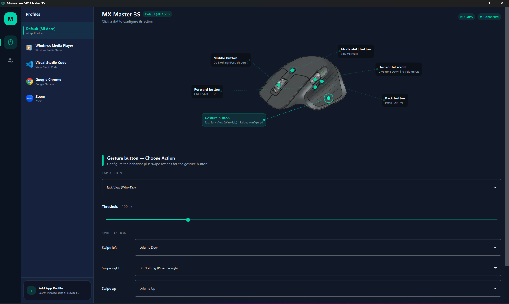
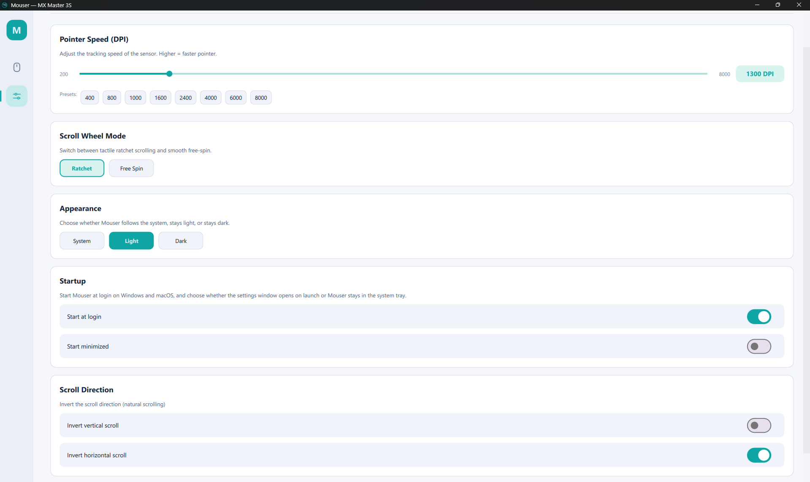

# Mouser — 罗技鼠标按键映射工具

> 非官方 G502 系列修改版。
>
> 本仓库基于原开源项目 Mouser 修改而来：
> [https://github.com/TomBadash/Mouser](https://github.com/TomBadash/Mouser)。
> 原项目使用 MIT License，本修改版保留原版权声明和许可证。
>
> 这个版本主要补充 Logitech G502 系列支持，尤其是 G502 HERO
> (`046D:C08B`)：新增/修正设备识别、G502 可视化布局、DPI/Profile
> 特殊按键的板载 F13–F16 解锁方案、动作环和状态提示中文化、用户配置
> 备份/导入/导出，以及启动时不弹出终端窗口的 Windows GUI 打包。

## G502 系列修改版说明

- 这不是 Logitech、G HUB 或原 Mouser 作者发布的官方版本。
- G502 HERO 的特殊按键通过板载配置交给 Mouser：DPI Shift → F13，
  DPI 降低 → F14，DPI 提高 → F15，配置切换 → F16。
- 当检测到支持的 G502 且已启用板载解锁后，Mouser 会拦截 F13–F16，
  并把它们作为 G502 的实体按键在界面里提供自定义映射。
- 修改 G502 板载内存前，Mouser 会先把备份保存到
  `%APPDATA%\Mouser\g502_backups`。
- 快捷键映射、Profile、动作环和个人设置可以在“设置 → 配置备份”里导出，
  换电脑或重装后再一键导入。
- 个人配置、板载备份和日志不会提交到这个公共仓库；换电脑时请使用单独的
  私有迁移备份包。

<p align="center">
  
</p>

中文文档｜[English README](README.md)

一个轻量、开源、**完全本地运行** 的 **Logitech Options+** 替代品，用于对罗技 HID++ 鼠标进行按键 / 手势重映射。当前对 **MX Master** 与 **MX Anywhere** 系列体验最佳，并对更多罗技型号提供识别与通用回退 UI。

**零遥测，零云端，无需罗技账号。**

---

## 目录

- [下载与运行](#下载与运行)
- [截图](#截图)
- [功能特性](#功能特性)
- [设备支持范围](#设备支持范围)
- [默认映射](#默认映射)
- [可用动作](#可用动作)
- [从源码构建](#从源码构建)
- [已知限制](#已知限制)
- [路线图](#路线图)
- [贡献指南](#贡献指南)
- [致谢](#致谢)
- [许可证](#许可证)

---

## 下载与运行

> **无需安装。** 下载 → 解压 → 双击运行即可。

1. 打开 [**最新 Release 页面**](https://github.com/meiyoutou/Mouser-G502/releases/latest)。
2. 下载 Windows G502 版本：`Mouser-G502-3.7.16-config-migration-guide-*.zip`。
3. 解压到任意目录，例如桌面或文档。
4. 双击运行 `Mouser.exe`。

原项目的官方发布包仍可在
[TomBadash/Mouser releases](https://github.com/TomBadash/Mouser/releases/latest) 获取。

完成。程序启动后会立即在托盘 / 菜单栏放置图标，并开始接管按键映射。

### 首次启动会看到什么

- 设置窗口打开后会进入设备感知的 **鼠标与配置（Mouse & Profiles）** 页。
- 系统托盘出现一个图标（Windows / Linux 在时钟旁，macOS 在菜单栏）。
- 关闭窗口不会退出程序，Mouser 会继续在托盘运行。要完全退出，请右键托盘图标 → **Quit Mouser**。
- Mouser 会记住语言和启动行为，下次启动自动恢复。

### 首次运行注意事项

- **Windows SmartScreen** 首次可能弹警告：点击 **More info** → **Run anyway**。
- **必须退出 Logitech Options+**。两者都会争夺 HID++ 访问权，请先退出 Options+ 再启动 Mouser。
- **macOS** 会请求 **辅助功能（Accessibility）** 权限，以便事件流（CGEventTap）能拦截鼠标事件。完整步骤请见 [readme_mac_osx.md](readme_mac_osx.md)。
- **Linux** 需要读取 `/dev/hidraw*`、`/dev/input/event*` 以及写入 `/dev/uinput`。解压后请运行一次随包附带的辅助脚本：
  ```bash
  cd /path/to/extracted/Mouser
  ./install-linux-permissions.sh
  ```
  之后重新插拔鼠标并重启 Mouser。
- 配置文件自动保存到：
  - `%APPDATA%\Mouser\config.json`（Windows）
  - `~/Library/Application Support/Mouser/config.json`（macOS）
  - `~/.config/Mouser/config.json`（Linux）
- 可在 **设置 → 配置备份** 导出/导入快捷键、Profile、动作环和个人设置。
  导入时选择的是 Mouser 自己导出的 `Mouser-settings-*.zip`，不是 GitHub 下载的程序 zip。
  Mouser 也会在用户设置文件夹里保留最近的自动备份。
- 日志按 5 × 5 MB 自动滚动，保存于 `%APPDATA%\Mouser\logs`、`~/Library/Logs/Mouser` 或 `$XDG_STATE_HOME/Mouser/logs`。

### 换电脑/重装时迁移个人配置

1. 在旧电脑打开 **设置 → 配置备份 → 导出个人配置包**。
2. 保存导出的 `Mouser-settings-YYYYMMDD-HHMMSS.zip`，可以放到 U 盘、网盘或你自己的私有备份里。
3. 在新电脑解压并打开 Mouser，然后进入 **设置 → 配置备份 → 导入个人配置包**。
4. 选择刚才导出的 `Mouser-settings-*.zip`。不要选择 GitHub 下载的 `Mouser-G502-*.zip`，那个是程序包。

---

## 截图

| 鼠标与配置 | 指针与滚动 |
|---|---|
|  |  |

---

## 功能特性

### 按键重映射

- **重映射任意可编程按键** — 中键、手势键、后退、前进、模式切换（Mode Shift）、DPI 切换（MX Vertical）以及水平滚轮。
- **鼠标按键互映** — 任意按键都可绑定为左键 / 右键 / 中键 / 后退 / 前进。
- **按应用 Profile** — 切换前台应用时（如 Chrome → VS Code）自动切换映射。
- **自定义快捷键** — 在 UI 中直接录制任意组合键（例如 `Ctrl+Shift+P`）。
- **配置备份 / 迁移** — 重装或换电脑前单独导出 `Mouser-settings-*.zip` 个人配置包，
  到新电脑后导入这个包即可恢复。
- **40+ 内置动作** — 导航、浏览器、编辑、媒体、滚动模式、DPI 等动作，会按平台自适配标签。

### 设备控制

- **DPI / 指针速度** — 滑块从 200 到设备上限（MX Master 为 8000），含快速预设；并提供可绑定到按键的 `Cycle DPI Presets` 动作。
- **Smart Shift** — 切换罗技“棘轮 ↔ 自由滚动”模式（HID++ `0x2111`），支持灵敏度阈值和可绑定的 `Toggle SmartShift` 动作。
- **滚动模式切换** — 将按键绑定为滚动模式切换，无需打开 UI 即可切换；默认绑定到 mode shift 按键。
- **滚动方向反转** — 垂直 / 水平方向可独立反转。
- **手势键 + 方向滑动** — 轻点为一个动作，上 / 下 / 左 / 右四个方向滑动各自绑定不同动作。

### 跨平台

- **Windows、macOS、Linux** — 各平台原生 hook（`WH_MOUSE_LL`、`CGEventTap`、`evdev` + `uinput`）。
- **macOS Intel 与 Apple Silicon 原生构建** — 分别提供 `Mouser-macOS-intel.zip` 与 `Mouser-macOS.zip`；菜单栏 App 以 `LSUIElement` 方式运行（不在 Dock 中显示）。
- **可调窗口大小** — 主窗口默认 1060 × 700，最小 920 × 620；鼠标示意图与控件会随窗口尺寸自适应排布。
- **开机自启** — Windows 注册表 / macOS 用户级 LaunchAgent，并提供独立的 **启动时最小化（Start minimized）** 选项，可直接启动到托盘。
- **单实例守护** — 重复启动会将已运行的窗口置前，而不会创建第二个实例。

### 智能连接

- **蓝牙与 Logi Bolt** — 三个平台都支持两种连接方式；UI 实时显示当前连接类型（仅在确认接收器 PID 时才显示 `Logi Bolt`）。
- **自动重连** — Mouser 监听断电 / 上电循环，无需重启即可重新绑定 HID++ 与系统鼠标 hook；每次重连（包括从睡眠唤醒）都会回放 SmartShift 设置。
- **实时连接状态** — UI 显示 Connected / Not Connected 徽标、设备型号和当前布局。
- **设备感知 UI** — MX Master 与 MX Anywhere 系列提供带可点击热区的交互示意图；其他型号使用通用回退卡片，并支持实验性的布局覆盖选择器。

### 多语言 UI

- **English / 简体中文 / 繁體中文** — 在应用内即时切换，无需重启。
- 语言偏好会保存到 `config.json`，下次启动自动恢复。
- 已覆盖：导航、鼠标页、设置页、对话框、托盘 / 菜单栏、权限提示等所有主要界面。

### 隐私优先

- **完全本地** — 配置为纯 JSON 文件，所有处理都在本机完成。
- **默认保护隐私** — Release 包和公共仓库不会包含你的配置、日志、截图或板载备份。
- **托盘 / 菜单栏** — 安静地后台运行。
- **零遥测、零云端、无需账号。**

---

## 设备支持范围

| 系列 / 型号 | 识别 + HID++ 探测 | UI 支持 |
|---|---|---|
| MX Master 4 / 3S / 3 / 2S / MX Master | 是 | 专用的逐型号交互布局 |
| MX Anywhere 3S / 3 / 2S | 是 | 专用的逐型号交互布局 |
| MX Vertical | 是 | 通用回退卡片（含 DPI 切换按键支持） |
| 其他罗技 HID++ 鼠标 | 按 PID / 名称尽力识别 | 通用回退卡片 |

> MX Master 与 MX Anywhere 系列拥有专用的可视化覆盖层。其他设备同样可被识别、显示型号名，并可启用实验性布局覆盖；但在专用覆盖层加入前，按键热区位置可能不够精确。要为你的设备添加支持，请见 [CONTRIBUTING_DEVICES.md](CONTRIBUTING_DEVICES.md)。

---

## 默认映射

| 按键 | 默认动作 |
|---|---|
| 后退（XButton1） | Alt + Tab（切换窗口） |
| 前进（XButton2） | Alt + Tab（切换窗口） |
| 中键 | 透传（Pass-through） |
| 手势键 | 透传 |
| 手势滑动（上 / 下 / 左 / 右） | 透传 |
| 模式切换（Mode shift，滚轮按压） | 切换滚动模式（棘轮 / 自由滚动） |
| 水平滚动左 | 浏览器后退 |
| 水平滚动右 | 浏览器前进 |
| DPI 切换（MX Vertical） | 透传 |

---

## 可用动作

动作标签会随平台自适配。Windows 提供 `Win+D` 与 `Task View`；macOS 提供 `Mission Control`、`Show Desktop`、`App Exposé`、`Launchpad`；Linux 回退到对应桌面环境的等价动作。

| 类别 | 动作 |
|---|---|
| **Navigation（导航）** | Alt+Tab、Alt+Shift+Tab、Show Desktop、Previous Desktop、Next Desktop、Task View（Windows）、Mission Control / App Exposé / Launchpad（macOS）、Page Up / Page Down / Home / End |
| **Browser（浏览器）** | Back、Forward、Close Tab（Ctrl+W）、New Tab（Ctrl+T）、Next Tab（Ctrl+Tab）、Previous Tab（Ctrl+Shift+Tab） |
| **Editing（编辑）** | Copy、Paste、Cut、Undo、Select All、Save、Find |
| **Media（媒体）** | Volume Up、Volume Down、Volume Mute、Play / Pause、Next Track、Previous Track |
| **Scroll（滚动）** | Switch Scroll Mode（棘轮 / 自由滚动）、Toggle SmartShift、Cycle DPI Presets |
| **Mouse（鼠标）** | Left Click、Right Click、Middle Click、Back（鼠标按键 4）、Forward（鼠标按键 5） |
| **Custom（自定义）** | 用户定义的快捷键组合（在 UI 中录制） |
| **Other（其他）** | Do Nothing（透传） |

---

## 从源码构建

只有在你想参与开发或运行开发版时才需要从源码构建。普通用户请直接下载 release zip — 见 [下载与运行](#下载与运行)。

### 共同前置条件

- **Windows 10/11**、**macOS 12+（Monterey）** 或 **Linux**（X11；KDE Wayland 用于应用检测）
- **Python 3.10+**（已在 3.14 上测试）
- 一只支持的罗技 HID++ 鼠标（蓝牙或 USB 接收器）
- **必须退出 Logitech Options+** — 它会与 HID++ 访问冲突
- 已安装 `git` 与可用的构建工具链

```bash
git clone https://github.com/meiyoutou/Mouser-G502.git
cd Mouser
python -m venv .venv
```

<details>
<summary><strong>Windows</strong></summary>

```powershell
.\.venv\Scripts\activate
pip install -r requirements.txt

# 直接从源码运行
python main_qml.py

# 或直接启动到托盘
python main_qml.py --start-hidden

# 构建便携版 zip
build.bat                # 标准构建
build.bat --clean        # 强制清理后重建
```

`build.bat` 会自动安装依赖、校验 `hidapi` 是否可导入，再用 PyInstaller 打包。输出位于 `dist\Mouser\`，将整个目录打包 zip 即可分发。

如需源码版无控制台窗口启动，可以创建一个使用 `pythonw.exe` 的快捷方式，详见 [DEVELOPMENT.md](DEVELOPMENT.md#desktop-shortcut-windows)。

</details>

<details>
<summary><strong>macOS</strong></summary>

```bash
source .venv/bin/activate
pip install -r requirements.txt

# 直接从源码运行
python main_qml.py
python main_qml.py --start-hidden     # 直接启动到菜单栏

# 构建原生菜单栏 App Bundle
pip install pyinstaller
./build_macos_app.sh
```

输出为 `dist/Mouser.app`。脚本优先使用 `images/AppIcon.icns`；若不存在，则从 `images/logo_icon.png` 生成 `.icns`。签名方式取决于是否设置了 `MOUSER_SIGN_IDENTITY`：

- **未设置（默认）**：使用 `codesign --sign -` 进行 ad-hoc 签名，适合一次性本地构建，但每次重建都可能改变 bundle 的代码身份，因此 macOS 可能要求重新授予辅助功能权限。
- **设置为代码签名身份**（可用 `security find-identity -v -p codesigning` 查看，推荐使用 SHA-1 形式）：会使用 hardened runtime 选项签名每个嵌套 `.dylib` / `.so` / `.framework`，然后用 `build_resources/Mouser.entitlements` 中的 hardened-runtime 例外权限签名外层 app。这是面向本地重复构建的开发者签名路径；稳定的 macOS 权限行为依赖相同源码、解析出的 Python 解释器、依赖版本、目标架构、签名身份、entitlements 和 timestamp 策略。
- 这**不是** notarized 发布签名流程。公开 macOS release zip 仍保持 ad-hoc 签名，直到未来单独加入 Developer ID 签名、安全 timestamp、notarization、stapling 和 Gatekeeper 校验流程。
- 构建时使用与目标架构一致的 Python：`arm64` Python 产出 Apple Silicon Bundle，`x86_64` Python 产出 Intel Bundle。可设置 `PYINSTALLER_TARGET_ARCH=arm64|x86_64|universal2` 来覆盖。
- 推送 tag 后，Release CI 会自动同时发布 `Mouser-macOS.zip`（Apple Silicon）与 `Mouser-macOS-intel.zip`（Intel）。
- 需要授予辅助功能（Accessibility）权限。完整步骤与平台差异请见 [readme_mac_osx.md](readme_mac_osx.md)。

</details>

<details>
<summary><strong>Linux</strong></summary>

```bash
source .venv/bin/activate
pip install -r requirements.txt

# 直接从源码运行
python main_qml.py

# 安装设备权限（仅需运行一次，之后重新插拔鼠标）
./packaging/linux/install-linux-permissions.sh

# 构建便携版
sudo apt-get install libhidapi-dev
pip install pyinstaller
pyinstaller Mouser-linux.spec --noconfirm
```

辅助脚本会安装 `69-mouser-logitech.rules`、重新加载 `udev`，并尝试 `modprobe uinput`。运行成功后，请重新插拔鼠标，完全退出 Mouser，然后以普通用户方式启动 — 无需 `sudo`。在不支持 logind / `uaccess` 的发行版上，将用户加入 `input` 组是兜底方案。

`xdotool` 用于 X11 的按应用 Profile 切换；`kdotool` 提供 KDE Wayland 支持。其他 Wayland 桌面环境会回退到默认 Profile。

</details>

> **自动化发布：** 推送 `v*` 标签会触发 [`.github/workflows/release.yml`](.github/workflows/release.yml)，CI 会构建 Windows、macOS（Apple Silicon + Intel）、Linux 产物，并上传到对应的 GitHub Release。

项目结构、架构图、HID++ 手势检测、引擎与重连流程、调试用 CLI 选项（`--hid-backend=iokit|hidapi|auto`）、运行测试套件等开发者文档，请见 [DEVELOPMENT.md](DEVELOPMENT.md)（英文）。要新增设备支持，请见 [CONTRIBUTING_DEVICES.md](CONTRIBUTING_DEVICES.md)。

---

## 已知限制

- **每设备映射尚未完全分离** — 布局覆盖按设备保存，但 Profile 中的按键映射仍是全局共享的。
- **与 Logitech Options+ 冲突** — 两者会争夺 HID++ 访问权，运行 Mouser 前请先退出 Options+。
- **滚动反转** 在 Windows 上使用合并后的事件注入，避免 LL hook 死锁；在主流应用中表现稳定，但在某些游戏或低级驱动中可能不正常。
- **不需要管理员权限** — 但被注入的按键事件可能无法到达提权窗口或某些游戏；如有需要可以以提权方式运行 Mouser。
- **Linux 应用检测有限** — X11 通过 `xdotool` 工作，KDE Wayland 通过 `kdotool` 工作；GNOME / 其他 Wayland 桌面环境仍回退到默认 Profile。
- **Linux 设备权限** — Mouser 需要访问 `/dev/hidraw*`、`/dev/input/event*` 与 `/dev/uinput`。请使用 [`install-linux-permissions.sh`](packaging/linux/install-linux-permissions.sh) 脚本配置一次，而不是长期以 root 运行。

---

## 路线图

- [ ] **更多设备的专用覆盖层** — 为 MX Vertical 及其他罗技系列添加真实热区图与示意图素材
- [ ] **真正的每设备配置** — 当一台机器接入多只罗技鼠标时，干净地分离各自的映射
- [ ] **动态按键清单** — 基于发现的 `REPROG_CONTROLS_V4` 控件构建按键列表，而不是依赖当前的固定按键集合
- [ ] **更好的滚动反转** — 探索驱动级或拦截驱动方案
- [ ] **手势滑动调优** — 提升滑动可靠性，并改进各设备的默认值
- [ ] **按应用 Profile 自动创建** — 检测新应用并提示创建 Profile
- [ ] **托盘图标徽标** — 在托盘 tooltip 中显示当前 Profile 名
- [ ] **更广的 Wayland 支持** — 把应用检测扩展到 X11 / KDE 之外，并在更多发行版上验证
- [ ] **插件系统** — 允许第三方动作提供者

---

## 贡献指南

非常欢迎贡献。

- **代码、修复、新功能：** Fork → 分支 → PR。开发环境、架构概览、调试选项与测试说明请见 [DEVELOPMENT.md](DEVELOPMENT.md)（英文）。
- **新增罗技鼠标支持：** 按 [CONTRIBUTING_DEVICES.md](CONTRIBUTING_DEVICES.md) 中的 discovery dump 流程操作即可，哪怕只提交一份 dump 也很有帮助。
- **目前需要帮助的方向：**
  - 在更多罗技 HID++ 设备上测试
  - 改进滚动反转
  - 更广的 Linux / Wayland 验证
  - UI / UX 打磨、无障碍、翻译

## 支持本项目

如果 Mouser 让你避开了 Logitech Options+，欢迎赞助开发：

<p align="center">
  <a href="https://github.com/sponsors/TomBadash">
    
  </a>
</p>

每一份支持都帮助项目持续推进 — 谢谢。

---

## 致谢

- **[@andrew-sz](https://github.com/andrew-sz)** — macOS 移植：CGEventTap 鼠标 hook、Quartz 按键模拟、NSWorkspace 应用检测以及 NSEvent 媒体键支持。
- **[@thisislvca](https://github.com/thisislvca)** — 项目重大扩展：包括 macOS 兼容性改进、多设备支持、新 UI 功能，以及对 Issue 的积极分类与跟进。
- **[@awkure](https://github.com/awkure)** — 跨平台开机自启（Windows 注册表 + macOS LaunchAgent）、单实例守护、启动时最小化选项、MX Master 4 识别。
- **[@hieshima](https://github.com/hieshima)** — Linux 支持（evdev + HID++ + uinput）、mode shift 按键映射、Smart Shift 开关、自定义快捷键支持、Linux 连接状态稳定化，以及 macOS CGEventTap 可靠性修复（超时自动重启、触摸板滚动过滤）。
- **[@pavelzaichyk](https://github.com/pavelzaichyk)** — Next Tab / Previous Tab 浏览器动作、持久滚动日志、Smart Shift 增强支持（HID++ `0x2111`，含灵敏度控制与滚动模式同步）。
- **[@nellwhoami](https://github.com/nellwhoami)** — 多语言 UI 系统（English、简体中文、繁體中文）以及 Page Up / Page Down / Home / End 导航动作。
- **[@guilamu](https://github.com/guilamu)** — 鼠标按键互映（左 / 右 / 中 / 后退 / 前进）以及 HID++ 稳定性修复（按键卡住自动释放、连续超时后自动重连、Windows hook 异步分发队列）。
- **[@vcanuel](https://github.com/vcanuel)** — macOS 上通过 `hidapi` 回退路径支持 Logi Bolt 接收器。
- **[@farfromrefug](https://github.com/farfromrefug)** — 缩小 macOS Bundle 体积（Qt Quick Controls 精简、QtDBus、Qt 资源过滤）。
- **[@MysticalMike60t](https://github.com/MysticalMike60t)** — README 结构思路（按 OS 折叠的构建小节）。

---

## 许可证

本项目使用 [MIT 协议](LICENSE)。

**Mouser** 与罗技（Logitech）无隶属关系亦未获其背书。“Logitech”“MX Master”“Options+” 为 Logitech International S.A. 的商标。
